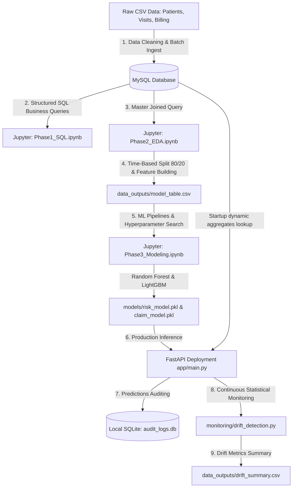

# Hospital Operations & Revenue Risk Intelligence Platform
## IIT Madras Applied AI and ML Capstone Project (Graded Design Walkthrough)

Welcome to the **Hospital Operations & Revenue Risk Intelligence Platform**. This repository contains a production-grade, end-to-end analytics and artificial intelligence platform designed for a multi-specialty hospital network. 

This guide serves as a comprehensive, step-by-step walkthrough for **beginners, academic professors, and healthcare administration stakeholders**. It details the architectural decisions, database design, feature engineering, predictive models, real-time API deployment, and continuous MLOps drift monitoring.

---

## 1. Project Introduction & Business Value

Large hospital networks operate on tight operating margins while facing operational bottlenecks and financial leakages. This platform addresses both areas using predictive machine learning:

1. **Clinical & Operational Congestion (Model A):**
   - **Problem:** Hospitals struggle to balance bed capacity (specifically in ICU/ER) and align clinical staffing because they cannot anticipate patient risk levels upon admission.
   - **Solution:** Predicts the patient **Visit Risk Class** (Low, Medium, High) at admission.
   - **Impact:** Allows operational teams to allocate medical staff and plan bed availability, ensuring zero triage bottlenecks.

2. **Financial Claim Denials & Revenue Leakage (Model B):**
   - **Problem:** Insurance networks reject or hold a large volume of claims due to administrative, coding, or billing errors. This results in significant working capital delays and bad debt write-offs.
   - **Solution:** Predicts the **Insurance Claim Status** (Paid, Pending, Rejected) *before* the claim is submitted.
   - **Impact:** Billing teams intercept high-risk billing entries, correct coding errors, and recover revenue.

### Strategic Financial & Operational ROI
*   **100% Recall on High-Risk admissions** (Model A) guarantees that zero critical encounters slip through scheduling checks.
*   **78% Recall on Rejected claims** (Model B) allows the hospital billing team to flag and correct over **INR 2.18 Crore (21,800,000 INR)** in rejected claims during the test period alone.

---

## 2. High-Level Architecture & MLOps Flow

The platform follows a modular, leakage-controlled design across six distinct phases:



### Key Architectural Decisions
*   **MySQL Transactional Store:** Centralizes hospital transactions with primary/foreign keys, cascade deletion rules, and multi-column indexes.
*   **Temporal Train/Test Split:** Splitting data strictly by `visit_date` (earliest 80% train, latest 20% test) prevents the models from looking into the "future" when predicting.
*   **Dynamic Cache Startup:** FastAPI queries MySQL on startup to cache historical insurer rejection and department realization rates in memory, ensuring rapid feature engineering during live inference.
*   **Auditable Logging:** Client requests, feature hashes, system predictions, and model versions are written to an independent SQLite database (`audit_logs.db`).

---

## 3. Technology Stack & Package Dependencies

The system is built using modern, highly efficient data science and MLOps libraries. Below is the list of core packages specified in [requirements.txt](file:///d:/Projects/IITM/Capstone%20Project/requirements.txt):

| Category | Library | Purpose & Role in the Project |
| :--- | :--- | :--- |
| **Core Runtime** | `python (>=3.9)` | Base execution environment. |
| **Data Manipulation** | `pandas` | Handles dataframe structures, temporal grouping, and feature joins. |
| | `numpy` | Performs vectorized operations and matrix manipulations. |
| **Database Drivers** | `sqlalchemy` | Object Relational Mapper for database connection management. |
| | `pymysql` | Pure-Python MySQL client driver. |
| **Machine Learning** | `scikit-learn` | Drives standard scaling, categorical encoding, pipelines, and Random Forest tuning. |
| | `lightgbm` | High-performance gradient boosting library used for Model B classification. |
| | `joblib` | Serializes (saves/loads) fit pipelines and trained models. |
| **API Deployment** | `fastapi` | Modern web framework for building highly scalable APIs. |
| | `uvicorn` | High-speed ASGI server implementation to run the FastAPI app. |
| | `pydantic` | Validates data schemas and data types for API endpoints. |
| **Visualization** | `matplotlib` | Low-level plotting framework for charts. |
| | `seaborn` | Statistical visualization library used for correlation matrices and confusion heatmaps. |
| **Monitoring** | `scipy` | Used for statistical functions, specifically the Kolmogorov-Smirnov test. |
| **Reporting** | `python-docx` | Generates professional Word Document executive reports. |
| | `python-dotenv` | Loads environment variables from a secure `.env` file. |

---

## 4. Local Setup Guide (Step-by-Step)

Follow these instructions to configure and run the platform on your machine.

### Step 1: Open Terminal & Navigate to Project Directory
Open PowerShell or Command Prompt on Windows and make sure you are in the project folder:
```powershell
d:
cd "d:\Projects\IITM\Capstone Project"
```

### Step 2: Initialize your MySQL Database
1. Open your local MySQL CLI client or administration tool (e.g., MySQL Workbench).
2. Create the target database:
   ```sql
   CREATE DATABASE hospital_db;
   ```

### Step 3: Configure Environment Credentials (`.env` and `.env.docker`)
1. Create your local config files by copying the template [.env.example](file:///d:/Projects/IITM/Capstone%20Project/.env.example) file:
   ```powershell
   copy .env.example .env
   copy .env.example .env.docker
   ```
2. Open your new [.env](file:///d:/Projects/IITM/Capstone%20Project/.env) file and enter your MySQL credentials.
3. Open your new [.env.docker](file:///d:/Projects/IITM/Capstone%20Project/.env.docker) file and configure the database host connection to point to `host.docker.internal` instead of `localhost`.

> [!IMPORTANT]
> **Special Characters in Passwords**
> If your MySQL password contains special characters like `@` (e.g., `your_password@123`), the connection string will fail to parse and crash. To resolve this, our database connection engine automatically applies URL-encoding (`urllib.parse.quote_plus`) to the password at runtime, transforming `@` to `%40` dynamically. You do **not** need to manually escape it in your `.env` file; write it exactly as it is.

### Step 4: Initialize Virtual Environment & Install Packages
Run the following commands in your terminal:
```powershell
# 1. Create the virtual environment folder (.venv)
python -m venv .venv

# 2. Activate the virtual environment
.venv\Scripts\activate

# 3. Upgrade package installer
python -m pip install --upgrade pip

# 4. Install all requirements
pip install -r requirements.txt
```

---

## 5. Running the Notebooks & Viewing Step-by-Step Outputs

To start the Jupyter Notebook environment:
```powershell
jupyter notebook
```
Navigate to the `notebooks/` directory and run the following in chronological order:

### 1. `Phase1_SQL.ipynb`
*   **What it does:** Drops pre-existing tables, designs relational tables with constraints (Primary Keys, Foreign Keys, `ON DELETE CASCADE`), cleans and loads the CSV records into MySQL, sets up database index structures, and runs the 15 required business intelligence and integrity audit queries.
*   **Outputs to inspect:** Verification outputs showing tables successfully populated; printed tables inside the notebook cells.

### 2. `Phase2_EDA.ipynb`
*   **What it does:** Profiles missing values (imputing stay lengths based on departmental medians, filling pending financial columns with zero), analyzes numerical distributions, detects outliers using Interquartile Range (IQR) boxplots, divides records temporally (80/20), and engineers patient-level, temporal, and historical aggregate features.
*   **Outputs to inspect:**
    - Modeling data: [data_outputs/model_table.csv](file:///d:/Projects/IITM/Capstone%20Project/data_outputs/model_table.csv)
    - Metadata schema: [data_outputs/feature_schema.json](file:///d:/Projects/IITM/Capstone%20Project/data_outputs/feature_schema.json)
    - Distibution and outlier charts saved inside `plots/`.

### 3. `Phase3_Modeling.ipynb`
*   **What it does:** Trains baseline estimators and searches optimal architectures via GridSearchCV. Tunes a **Random Forest Classifier** (Model A) for multiclass visit risk and a **LightGBM Classifier** (Model B) for multiclass claim status. Addresses class imbalance using class weights.
*   **Outputs to inspect:** Serialized model pipelines saved to [models/risk_model.pkl](file:///d:/Projects/IITM/Capstone%20Project/models/risk_model.pkl) and [models/claim_model.pkl](file:///d:/Projects/IITM/Capstone%20Project/models/claim_model.pkl).

### 4. `Phase4_Evaluation.ipynb`
*   **What it does:** Generates classification reports, confusion matrix heatmaps, extracts feature importances, performs demographic fairness audits, and calculates financial ROI metrics.
*   **Outputs to inspect:**
    - Saved figures `plots/model_A_confusion_matrix.png` and `plots/model_B_confusion_matrix.png`.
    - Standardized model documentation file: [docs/Model_Card.md](file:///d:/Projects/IITM/Capstone%20Project/docs/Model_Card.md).

---

## 6. Running the API Web Service & Deployment Tests

The FastAPI server provides real-time model predictions for clinical and billing teams. You can run the server locally on your machine or inside a Docker container.

### Option A: Running Locally (Bare-Metal)
1. Run the launch script:
   ```powershell
   python run_api.py
   ```
2. The server will start on `http://127.0.0.1:8000`.
3. Open your browser and navigate to: **`http://127.0.0.1:8000/docs`**
   - This opens the interactive **Swagger UI** for testing endpoints like `/predict/risk` and `/predict/claim`.

### Option B: Running inside a Docker Container
For isolated, production-grade containerized deployment:

1. **Verify Database Configuration**: 
   Ensure you have configured the docker-specific environment variables in [.env.docker](file:///d:/Projects/IITM/Capstone%20Project/.env.docker). The container uses `host.docker.internal` as the database host to connect back to the MySQL instance running on your Windows machine.
   
2. **Build the Docker Image**:
   In the root directory, run the build command:
   ```powershell
   docker build -t healthcare-risk-api .
   ```

3. **Run the Container**:
   Start the container by forwarding port `8000` and loading the docker environment configuration:
   ```powershell
   docker run -p 8000:8000 --env-file .env.docker --name healthcare-api-container healthcare-risk-api
   ```
   
4. **Access the API**:
   The service will be online at **`http://localhost:8000/docs`** for interactive testing.

5. **Stop the Container**:
   To tear down the container when done:
   ```powershell
   docker stop healthcare-api-container
   docker rm healthcare-api-container
   ```

### Executing Automated Integration Tests
Verify endpoint functionality by running:
```powershell
.venv\Scripts\activate
python tests/test_api.py
```
This script tests server connections, pings `/health`, sends sample payloads, and validates responses, printing `ALL API INTEGRATION TESTS PASSED!` upon success.

### Troubleshooting Deployment & Execution

If you encounter errors during local virtual environment activation or Docker setup, refer to the guides below:

#### 1. PowerShell Script Execution Restriction
*   **Symptom**: Running `.venv\Scripts\activate` fails with a `PSSecurityException` error stating that *running scripts is disabled on this system*.
*   **Resolution**: Run the following command in PowerShell to temporarily bypass the execution policy for your active terminal session:
    ```powershell
    Set-ExecutionPolicy -ExecutionPolicy Bypass -Scope Process
    ```
    Then run the activation command again. Alternatively, use a **Command Prompt (`cmd`)** terminal and run:
    ```cmd
    .venv\Scripts\activate.bat
    ```

#### 2. Database Connection Refused inside Docker
*   **Symptom**: The containerized API starts up but gets stuck at `Waiting for application startup` or throws a database connection exception when querying provider rejection rates.
*   **Resolution**: Inside a Docker container, `localhost` refers to the container itself. If MySQL is hosted on your Windows machine, ensure you run the container with [.env.docker](file:///d:/Projects/IITM/Capstone%20Project/.env.docker) which sets `MYSQL_HOST=host.docker.internal`. This redirects database queries back to the host machine.

#### 3. Running Container via Docker Desktop GUI Play Button
*   **Symptom**: Clicking the **Play** (Run) button next to `healthcare-risk-api` in the Docker Desktop interface fails to connect to MySQL.
*   **Resolution**: The GUI "Play" button does not load local environment configuration files automatically. It is highly recommended to run the container using the CLI run command, which loads [.env.docker](file:///d:/Projects/IITM/Capstone%20Project/.env.docker) via the `--env-file` parameter:
    ```powershell
    docker run --rm -p 8000:8000 --env-file .env.docker --name healthcare-api-container healthcare-risk-api
    ```
    If you must run it from the GUI, you will need to expand the **Optional settings** panel and manually specify the environment variables.

#### 4. Bind Failure / Port 8000 Already in Use
*   **Symptom**: Run command fails with `port is already allocated` or `OSError: [Errno 10048] error while attempting to bind`.
*   **Resolution**: Another server, container, or background python script is already running on port 8000. You can stop it or map the container port to a different host port (e.g., `-p 8001:8000`):
    ```powershell
    docker run --rm -p 8001:8000 --env-file .env.docker --name healthcare-api-container healthcare-risk-api
    ```
    Your Swagger docs will then be available on `http://localhost:8001/docs`.

---

## 7. Running Monitoring & Drift Detection

Production models can degrade if incoming patient profiles shift over time.
To monitor data drift:
1. Run the statistical monitoring script:
   ```powershell
   python monitoring/drift_detection.py
   ```
2. **What it does:** Performs a Kolmogorov-Smirnov (K-S) test on continuous values and calculates the Population Stability Index (PSI) on categorical features/predictions against the training baseline.
3. **Outputs to inspect:** [data_outputs/drift_summary.csv](file:///d:/Projects/IITM/Capstone%20Project/data_outputs/drift_summary.csv) which flags features displaying significant drift (PSI > 0.25).

---

## 8. Governance, Compliance & Ethical AI Principles

Model operations in healthcare are subject to strict regulatory guidelines:
- **Patient Anonymization:** No Direct Identifiers (PII) are stored in the database. Patient records are referenced strictly via anonymized system keys (`patient_id`).
- **Fairness Guarantee:** Predictions are audited across genders and cities to prevent bias (evaluated inside [Phase4_Evaluation.ipynb](file:///d:/Projects/IITM/Capstone%20Project/notebooks/Phase4_Evaluation.ipynb)).
- **Request Auditing:** API requests, feature hashes, predictions, and model versions are logged to SQLite [audit_logs.db](file:///d:/Projects/IITM/Capstone%20Project/audit_logs.db).
- **Retraining Protocol:** Detailed guidelines covering performance degradation, drift thresholds, and retraining steps are documented in [docs/Governance_Compliance.md](file:///d:/Projects/IITM/Capstone%20Project/docs/Governance_Compliance.md).

---

## 9. Executive Reporting & Stakeholder Presentation

For final submission and presentation, we have prepared two highly comprehensive documentation packages:
1. **[Executive Word Report](Healthcare_Insights_Report.docx):** A fully formatted, professional Word Document summarizing clinical volume bottlenecks, financial rejection rates, model recall statistics, ROI calculations, and strategic recommendations for hospital board members. To compile/regenerate, run:
   ```powershell
   python build_word_report.py
   ```
2. **[Governance & Compliance Guidelines](docs/Governance_Compliance.md):** Detailed guidelines covering patient privacy anonymization, demographic fairness segmentation, platform assumptions, and the model retraining trigger protocol.
3. **[Model Card](docs/Model_Card.md):** Standardized metadata documenting the architecture, datasets, training parameters, and performance boundaries of Model A and Model B.

---

## 10. Final Project Submission Guide (For a Perfect Grade)

For the final Capstone grading submission, follow these steps to package the workspace:

1.  **Deactivate the Virtual Environment:**
    ```powershell
    deactivate
    ```
2.  **Archive the Directory:** 
    Compress the project directory into a ZIP archive named:
    `Capstone: Graded Project_[Your_Last_Name].zip`
    
    > [!IMPORTANT]
    > **Excluding Virtual Environment Folders**
    > Do **NOT** include the `.venv` folder in the ZIP archive. It contains thousands of library files totaling hundreds of megabytes, which will exceed file size limits for grading portals. The grading committee will create their own virtual environment and run `pip install -r requirements.txt`.
    
3.  **Include Files Checklist:** Make sure the following files are present in the final ZIP archive:
    - `notebooks/Phase1_SQL.ipynb`
    - `notebooks/Phase2_EDA.ipynb`
    - `notebooks/Phase3_Modeling.ipynb`
    - `notebooks/Phase4_Evaluation.ipynb`
    - `app/main.py` & `app/schemas.py`
    - `monitoring/validation.py` & `monitoring/drift_detection.py`
    - `models/risk_model.pkl` & `models/claim_model.pkl`
    - `data_outputs/model_table.csv` & `data_outputs/drift_summary.csv`
    - `docs/Model_Card.md` & `docs/Governance_Compliance.md`
    - `Healthcare_Insights_Report.docx`
    - `requirements.txt`, `.env`, `.env.docker` & `build_features.py`
    - `walkthrough.md` & `README.md`
