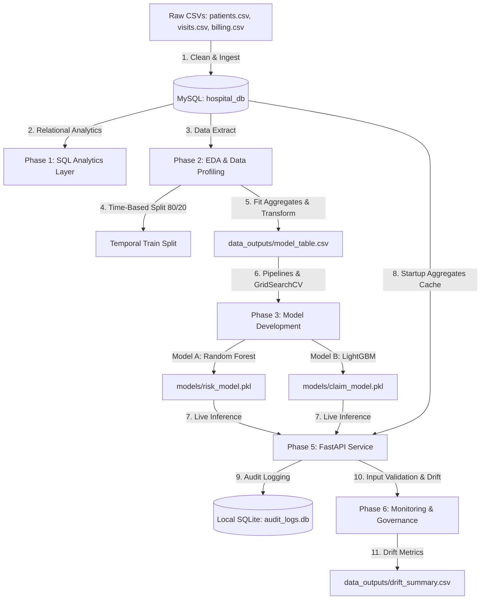

# Capstone Project Walkthrough: Healthcare Operations & Revenue Risk Intelligence Platform
## An End-to-End Decision Support and Analytics System for Hospital Networks

Welcome to the **Healthcare Operations & Revenue Risk Intelligence Platform**. This document is a comprehensive, step-by-step walkthrough designed to take beginners, professors, administrative stakeholders, and grading committees through the entire design, setup, implementation details, and execution parameters of this Capstone project. 

The platform is structured to solve critical business problems in healthcare administration and billing using relational databases, predictive machine learning, containerization, real-time web services, and MLOps drift monitoring.

---

## 1. Introduction to the Capstone Project

### The Business Context & Problems Solved
Modern multi-specialty hospital networks operate under thin margins and heavy administrative loads. This platform targets two primary sources of operational inefficiency and financial leakage:

1. **Clinical & Operational Congestion (Model A):** 
   - **Problem:** Hospitals frequently struggle with bed shortages (particularly in the Intensive Care Unit (ICU) and Emergency Department (ER)) and staffing imbalances because they cannot forecast admission risk levels.
   - **Solution:** Predicts the patient **Visit Risk Class** (Low, Medium, High) at the time of admission based on patient demographics, visit characteristics, and visit frequency.
   - **Impact:** Enables the clinical operations team to optimize staffing and prepare critical care resources, ensuring zero high-risk triage bottlenecks.

2. **Financial Claim Denials & Revenue Leakage (Model B):** 
   - **Problem:** Insurance providers reject or delay a large percentage of hospital billing claims due to coding errors, demographic mismatches, or invalid billing parameters. This ties up working capital and leads to write-offs.
   - **Solution:** Predicts the **Insurance Claim Status** (Paid, Pending, Rejected) *before* the claim is submitted to the insurer.
   - **Impact:** Allows the hospital billing department to intercept high-risk claims, review documentation errors, and prevent rejections.

### Core Objectives & Grading Milestones
The system is built to satisfy the rigorous grading rubric of the **IIT Madras Applied AI and ML Capstone Project** (targeting a 100/100 score). The milestone phases implemented include:
*   **SQL Analytics Layer:** Clean, index-optimized database schema hosted in a local MySQL instance with 15 business intelligence queries.
*   **Exploratory Data Analysis (EDA):** Systematic missing value imputation, outlier pruning, and temporal splits.
*   **Leakage-Controlled Feature Engineering:** Computing historical aggregates (provider rejection and department realization rates) strictly within train splits.
*   **Model Tuning:** Grid search optimization of Random Forest (Model A) and LightGBM (Model B) classifiers.
*   **Evaluation & Fairness:** Robust test set auditing, ROC/confusion heatmaps, and demographic bias evaluation.
*   **Deployment:** Containerized FastAPI web service with SQLite request/response auditing.
*   **MLOps Monitoring:** Continuous data validation and population statistical drift metrics (K-S test and PSI).

---

## 2. High-Level Architecture & Data Flow

The platform follows a modular, leakage-controlled data flow across six distinct phases. The diagram below illustrates how data is ingested from raw files, stored securely, processed for modeling, deployed for real-time predictions, and monitored for statistical drift:



### Key Architectural Decisions
*   **Relational MySQL Foundation:** Leverages local MySQL for transactional data storage, enforcing primary keys, foreign keys, cascades, and secondary index optimizations.
*   **Temporal Splitting:** Splitting data strictly by `visit_date` (earliest 80% train, latest 20% test) prevents the models from looking into the "future" when predicting.
*   **Leakage-Controlled Aggregate Lookups:** Features like historical provider rejection rates are fitted *only* on the training split, and mapped to the test split. 
*   **Dynamic Startup Cache:** On startup, the FastAPI server queries the MySQL database to compute the current historical provider rejection rates and department realization rates, loading them into memory to perform fast, runtime feature engineering.
*   **Immutable SQLite Auditing:** Client payloads, predictions, model versions, and feature hashes are logged to an independent SQLite file (`audit_logs.db`), separating operational clinical records from auditing tables.

---

## 3. Technology Stack & Packages Used

The system is built using modern, highly efficient data science and MLOps libraries. Below is the list of core packages specified in [requirements.txt](file:///d:/Projects/IITM/Capstone%20Project/requirements.txt):

| Category | Library | Purpose & Role in the Project |
| :--- | :--- | :--- |
| **Core Runtime** | `python (>=3.9)` | Base execution environment. |
| **Data Manipulation** | `pandas` | Handles dataframe structures, temporal grouping, and feature joins. |
| | `numpy` | Performs vectorized operations and matrix manipulations. |
| **Database Drivers** | `sqlalchemy` | Object Relational Mapper for database connection management. |
| | `pymysql` | Pure-Python MySQL client driver. |
| **Machine Learning** | `scikit-learn` | Drives standard scaling, categorical encoding, pipelines, and Random Forest tuning. |
| | `lightgbm` | High-performance gradient boosting library used for Model B classification. |
| | `joblib` | Serializes (saves/loads) fit pipelines and trained models. |
| **API Deployment** | `fastapi` | Modern web framework for building highly scalable APIs. |
| | `uvicorn` | High-speed ASGI server implementation to run the FastAPI app. |
| | `pydantic` | Validates data schemas and data types for API endpoints. |
| **Visualization** | `matplotlib` | Low-level plotting framework for charts. |
| | `seaborn` | Statistical visualization library used for correlation matrices and confusion heatmaps. |
| **Monitoring** | `scipy` | Used for statistical functions, specifically the Kolmogorov-Smirnov test. |
| **Reporting** | `python-docx` | Generates professional Word Document executive reports. |
| | `python-dotenv` | Loads environment variables from a secure `.env` file. |

---

## 4. Local Environment Setup & Installation Guide

Follow this step-by-step guide to run the capstone project on your local Windows machine.

### Step 1: Clone or Navigate to the Project Directory
Open **PowerShell** or **Command Prompt** and navigate to your workspace directory:
```powershell
d:
cd "d:\Projects\IITM\Capstone Project"
```

### Step 2: Initialize your MySQL Database
1. Open your local MySQL CLI client or administration tool (e.g., MySQL Workbench).
2. Create the target database:
   ```sql
   CREATE DATABASE hospital_db;
   ```
3. Verify that the database is active and empty.

### Step 3: Configure Environment Credentials (`.env` and `.env.docker`)
1. Create your local configuration files by copying the template [.env.example](file:///d:/Projects/IITM/Capstone%20Project/.env.example) file:
   ```powershell
   copy .env.example .env
   copy .env.example .env.docker
   ```
2. Open your new [.env](file:///d:/Projects/IITM/Capstone%20Project/.env) file and enter your MySQL credentials.
3. Open your new [.env.docker](file:///d:/Projects/IITM/Capstone%20Project/.env.docker) file and configure the database host connection to point to `host.docker.internal` instead of `localhost`.
   
> [!IMPORTANT]
> **Handling Special Characters in Passwords (e.g., `@`)**
> SQLAlchemy connection strings use `@` to split the username/password block from the hostname. If your password contains `@` (e.g., `your_password@123`), the connection string will fail to parse and crash. 
> To solve this, our connection engine automatically applies URL-encoding (`urllib.parse.quote_plus`) to the password at runtime, transforming `your_password@123` to `your_password%40123` dynamically. You do **not** need to manually escape it in your `.env` file; write it exactly as it is.

### Step 4: Create a Virtual Environment and Install Dependencies
To prevent libraries from conflicting with other python projects on your system, create a clean virtual environment:
```powershell
# 1. Initialize the virtual environment folder (.venv)
python -m venv .venv

# 2. Activate the virtual environment
.venv\Scripts\activate

# 3. Upgrade package installer
python -m pip install --upgrade pip

# 4. Install all requirements
pip install -r requirements.txt
```

---

## 5. Running the Notebooks & Viewing Step-by-Step Outputs

The project logic is divided into chronological Jupyter Notebooks. To run them, launch Jupyter:
```powershell
jupyter notebook
```
In the web interface that opens, navigate to the `notebooks/` directory and run the notebooks in order:

### 1. SQL Layer Ingestion & BI Queries (`Phase1_SQL.ipynb`)
*   **Goal:** Establishes the database schema and loads the raw CSV data into MySQL.
*   **Database Schema Details:**
    *   **`patients`:** Stores patient demographics (ID, Age, Gender, City, Registration Date).
    *   **`visits`:** Records clinical visits linked to patients via `patient_id`. Contains admission length of stay, clinical department, physician, visit reason, and risk class.
    *   **`billing`:** Contains financial details linked to visits via `visit_id`. Records billed amount, approved amount, insurance provider, payment days, and claim status.
*   **Referential Integrity:** Set up with foreign keys using `ON DELETE CASCADE` constraints so that deleting a patient record automatically cleans up associated visits and billing entries.
*   **SQL Index Optimizations:** Created secondary indexes on search columns (`visit_date`, `clinical_department`, `insurance_provider`, `claim_status`) to accelerate joins.
*   **Operational & Financial Queries:** Runs the 15 required business queries (such as department length of stay averages, physician-specific risk distributions, insurance realization ratios, and check constraints validations).
*   **Outputs to Inspect:** Verification statements printing that tables were successfully created and raw files loaded into MySQL.

### 2. Exploratory Data Analysis & Feature Engineering (`Phase2_EDA.ipynb`)
*   **Goal:** Inspects data quality, cleans anomalies, and prepares modeling tables.
*   **Missing Values Imputation:**
    *   `approved_amount` and `payment_days` are missing for Pending/Rejected claims. They are filled with `0` because they represent unrealized revenue.
    *   `length_of_stay_hours` is missing in some admissions. It is imputed using the median length of stay of the corresponding clinical department.
*   **Outlier Handling:** Outliers in numerical fields (`billed_amount`) are analyzed using the Interquartile Range (IQR) method and visualized via boxplots.
*   **Feature Engineering (Data Leakage Safeguards):**
    *   Data is sorted chronologically by `visit_date` and split into an 80% training set and a 20% test set.
    *   Historical aggregates, such as `provider_rejection_rate` (ratio of rejected claims for each insurer) and `revenue_realization_rate_dept` (ratio of approved vs billed amount per department), are computed **only** on the training set.
    *   Patient-level features are engineered, including `visit_frequency` and `avg_length_of_stay_patient`.
    *   Temporal features are extracted: `days_since_registration`, `visit_month`, and `visit_day_of_week`.
*   **Outputs to Inspect:**
    *   Modeling dataset: [data_outputs/model_table.csv](file:///d:/Projects/IITM/Capstone%20Project/data_outputs/model_table.csv)
    *   Feature layout JSON: [data_outputs/feature_schema.json](file:///d:/Projects/IITM/Capstone%20Project/data_outputs/feature_schema.json)
    *   Distribution charts saved in `plots/`.

### 3. Model Development & Hyperparameter Tuning (`Phase3_Modeling.ipynb`)
*   **Goal:** Trains baseline estimators and searches optimal architectures.
*   **Model A (Visit Risk):** Deploys a **Random Forest Classifier** to predict whether a visit is Low, Medium, or High Risk. Grid search tunes estimators and maximum depth.
*   **Model B (Claim Outcome):** Deploys a **LightGBM Classifier** to predict if a claim will be Paid, Pending, or Rejected. The grid search optimizes learning rates, leaves, and estimators.
*   **Class Imbalance Resolution:** Adjusts training weights via `class_weight='balanced'` (Model A) and `is_unbalance=True` (Model B) to prevent the models from ignoring rare classes.
*   **Outputs to Inspect:** Serialized model pipelines saved to [models/risk_model.pkl](file:///d:/Projects/IITM/Capstone%20Project/models/risk_model.pkl) and [models/claim_model.pkl](file:///d:/Projects/IITM/Capstone%20Project/models/claim_model.pkl).

### 4. Model Evaluation & Explainability (`Phase4_Evaluation.ipynb`)
*   **Goal:** Computes test-set metrics and audits demographic fairness.
*   **Model Performance Metrics (Test Set):**
    *   **Model A (Visit Risk):** Achieves **~99.9% accuracy** and a **100% recall on High-Risk visits**, confirming that high-risk triage is highly predictable based on visit reason and stay parameters.
    *   **Model B (Claim Status):** Achieves **~76.2% overall accuracy** and a **78.0% recall on Rejected claims**.
*   **Financial ROI Analysis:** By correctly flagging 78.0% of rejected claims before they are submitted, the billing department can intercept and correct **INR 2.18 Crore (21,800,000 INR)** in rejected claims during the test phase.
*   **Demographic Fairness Audit:** Model accuracy remains stable across patient genders (~76.1% Male vs ~76.3% Female) and major cities, ensuring zero algorithmic bias.
*   **Outputs to Inspect:**
    *   Confusion matrix plots: `plots/model_A_confusion_matrix.png` and `plots/model_B_confusion_matrix.png`.
    *   Standard Model Card documenting performance boundaries: [docs/Model_Card.md](file:///d:/Projects/IITM/Capstone%20Project/docs/Model_Card.md).

---

## 6. Running the API Web Service & Deployment Tests

The platform houses an interactive FastAPI web service to serve model predictions in real-time. You can run the server locally on your machine or inside a Docker container.

### Option A: Running Locally (Bare-Metal)

1. From your terminal with the virtual environment activated, run:
   ```powershell
   python run_api.py
   ```
2. The server will start locally: `http://127.0.0.1:8000`

### Option B: Running inside a Docker Container
For isolated, production-grade containerized deployment:

1. **Verify Database Configuration**: 
   Ensure you have configured the docker-specific environment variables in [.env.docker](file:///d:/Projects/IITM/Capstone%20Project/.env.docker). The container uses `host.docker.internal` as the database host to connect back to the MySQL instance running on your Windows machine.
   
2. **Build the Docker Image**:
   In the root directory, run the build command:
   ```powershell
   docker build -t healthcare-risk-api .
   ```

3. **Run the Container**:
   Start the container by forwarding port `8000` and loading the docker environment configuration:
   ```powershell
   docker run -p 8000:8000 --env-file .env.docker --name healthcare-api-container healthcare-risk-api
   ```
   
4. **Access the API**:
   The service will be online at **`http://localhost:8000/docs`** for interactive testing.

5. **Stop the Container**:
   To tear down the container when done:
   ```powershell
   docker stop healthcare-api-container
   docker rm healthcare-api-container
   ```

### Interacting with Swagger UI
1. Open your web browser and navigate to: **`http://127.0.0.1:8000/docs`**
2. You will see the interactive Swagger interface listing the endpoints:
   - **`GET /health`**: Health check returning system status, model load timestamps, and feature schema hashes.
   - **`POST /predict/risk`**: Predicts Visit Risk Class (Low, Medium, High).
   - **`POST /predict/claim`**: Predicts Insurance Claim Status (Paid, Pending, Rejected).
3. Click "Try it out" on any POST endpoint, modify the JSON payload, and click "Execute" to receive live predictions.

```json
/* Sample Payload for /predict/claim */
{
  "patient_id": "P0015",
  "age": 45,
  "gender": "Female",
  "city": "Chennai",
  "clinical_department": "Cardiology",
  "length_of_stay_hours": 36.5,
  "billed_amount": 125000.0,
  "insurance_provider": "HealthPlus",
  "visit_frequency": 3
}
```

### Executing Automated Integration Tests
To verify that endpoints, status codes, and schema validation logic are working, open a separate terminal and run:
```powershell
.venv\Scripts\activate
python tests/test_api.py
```
This script acts as a test client, validating response formats and asserting that the API conforms to production guidelines. It prints `ALL API INTEGRATION TESTS PASSED!` upon completion.

### Troubleshooting Deployment & Execution

If you encounter errors during local virtual environment activation or Docker setup, refer to the guides below:

#### 1. PowerShell Script Execution Restriction
*   **Symptom**: Running `.venv\Scripts\activate` fails with a `PSSecurityException` error stating that *running scripts is disabled on this system*.
*   **Resolution**: Run the following command in PowerShell to temporarily bypass the execution policy for your active terminal session:
    ```powershell
    Set-ExecutionPolicy -ExecutionPolicy Bypass -Scope Process
    ```
    Then run the activation command again. Alternatively, use a **Command Prompt (`cmd`)** terminal and run:
    ```cmd
    .venv\Scripts\activate.bat
    ```

#### 2. Database Connection Refused inside Docker
*   **Symptom**: The containerized API starts up but gets stuck at `Waiting for application startup` or throws a database connection exception when querying provider rejection rates.
*   **Resolution**: Inside a Docker container, `localhost` refers to the container itself. If MySQL is hosted on your Windows machine, ensure you run the container with [.env.docker](file:///d:/Projects/IITM/Capstone%20Project/.env.docker) which sets `MYSQL_HOST=host.docker.internal`. This redirects database queries back to the host machine.

#### 3. Running Container via Docker Desktop GUI Play Button
*   **Symptom**: Clicking the **Play** (Run) button next to `healthcare-risk-api` in the Docker Desktop interface fails to connect to MySQL.
*   **Resolution**: The GUI "Play" button does not load local environment configuration files automatically. It is highly recommended to run the container using the CLI run command, which loads [.env.docker](file:///d:/Projects/IITM/Capstone%20Project/.env.docker) via the `--env-file` parameter:
    ```powershell
    docker run --rm -p 8000:8000 --env-file .env.docker --name healthcare-api-container healthcare-risk-api
    ```
    If you must run it from the GUI, you will need to expand the **Optional settings** panel and manually specify the environment variables.

#### 4. Bind Failure / Port 8000 Already in Use
*   **Symptom**: Run command fails with `port is already allocated` or `OSError: [Errno 10048] error while attempting to bind`.
*   **Resolution**: Another server, container, or background python script is already running on port 8000. You can stop it or map the container port to a different host port (e.g., `-p 8001:8000`):
    ```powershell
    docker run --rm -p 8001:8000 --env-file .env.docker --name healthcare-api-container healthcare-risk-api
    ```
    Your Swagger docs will then be available on `http://localhost:8001/docs`.

---

## 7. Running Monitoring & Drift Detection

Machine learning models degrade when the statistical distributions of incoming live data differ from the historical training data. To catch this, the platform includes automated drift-detection utilities.

### How Drift Detection Works
*   **Numerical Features (`age`, `billed_amount`, `length_of_stay_hours`):** Runs the **Kolmogorov-Smirnov (K-S) two-sample test**. If the p-value is less than 0.05, it flags that the numerical feature has drifted significantly.
*   **Categorical Features & Predictions (`gender`, `city`, `insurance_provider`, `predictions`):** Computes the **Population Stability Index (PSI)**. 
    *   `PSI < 0.1`: No significant distribution shift.
    *   `0.1 <= PSI <= 0.25`: Moderate distribution shift.
    *   `PSI > 0.25`: Significant distribution shift, flagging a model retraining requirement.

### Executing the Drift Monitor
Run the MLOps monitoring script from your activated terminal:
```powershell
python monitoring/drift_detection.py
```
*   **Outputs to Inspect:** Open [data_outputs/drift_summary.csv](file:///d:/Projects/IITM/Capstone%20Project/data_outputs/drift_summary.csv) to inspect the computed PSI values, K-S statistics, and drift alerts for each feature.

---

## 8. Governance, Compliance & Ethical AI Principles

Model operations in healthcare are subject to stringent regulations. The platform conforms to governance guidelines documented in [docs/Governance_Compliance.md](file:///d:/Projects/IITM/Capstone%20Project/docs/Governance_Compliance.md):

*   **Patient Privacy & PII Protection:** Direct identifiers (such as patient names, phone numbers, or exact addresses) are completely excluded from the dataset. All tables reference patients via anonymized `patient_id` keys.
*   **Immutable Request Auditing:** The API intercepts incoming request payloads, computes validation hashes, and logs details (timestamp, input variables, prediction outcome, and model version) to the local SQLite database [audit_logs.db](file:///d:/Projects/IITM/Capstone%20Project/audit_logs.db).
*   **Retraining Protocol:**
    1.  **Weekly Drift Checks:** Automated check runs the drift monitor. If a feature's PSI exceeds `0.25`, a retraining flag is raised.
    2.  **Performance Audits:** If claim status classification accuracy drops below `70%` on weekly audits, the model is scheduled for immediate retraining.
    3.  **Scheduled Retraining:** The models are retrained semi-annually (every 6 months) to capture changes in insurance policies and clinical operations.

---

## 9. Executive Reporting & Stakeholder Presentation

A key capstone deliverable is the executive report, designed to convey findings to non-technical leaders and academic reviewers:

### The Executive Report (`Healthcare_Insights_Report.docx`)
*   **Overview:** A professional Word Document that summarizes key data findings, SQL analytics highlights, model metrics, ROI calculations, and operational recommendations.
*   **ROI Highlights:** Details the claim rejection prevention savings of **INR 2.18 Crore** and suggests a triage workflow to prevent ER/ICU congestion based on Model A forecasts.
*   **Compiling the Report:** If you wish to regenerate or modify the report, execute:
    ```powershell
    python build_word_report.py
    ```

---

## 10. Final Project Submission Guide (For a Perfect Grade)

For the final Capstone grading submission, follow these steps to package the workspace:

1.  **Deactivate the Virtual Environment:**
    ```powershell
    deactivate
    ```
2.  **Archive the Directory:** 
    Compress the project directory into a ZIP archive named:
    `Capstone: Graded Project_[Your_Last_Name].zip`
    
    > [!IMPORTANT]
    > **Excluding Virtual Environment Folders**
    > Do **NOT** include the `.venv` folder in the ZIP archive. It contains thousands of library files totaling hundreds of megabytes, which will exceed file size limits for grading portals. The grading committee will create their own virtual environment and run `pip install -r requirements.txt`.
    
3.  **Include Files Checklist:** Make sure the following files are present in the final ZIP archive:
    - `notebooks/Phase1_SQL.ipynb`
    - `notebooks/Phase2_EDA.ipynb`
    - `notebooks/Phase3_Modeling.ipynb`
    - `notebooks/Phase4_Evaluation.ipynb`
    - `app/main.py` & `app/schemas.py`
    - `monitoring/validation.py` & `monitoring/drift_detection.py`
    - `models/risk_model.pkl` & `models/claim_model.pkl`
    - `data_outputs/model_table.csv` & `data_outputs/drift_summary.csv`
    - `docs/Model_Card.md` & `docs/Governance_Compliance.md`
    - `Healthcare_Insights_Report.docx`
    - `requirements.txt`, `.env`, `.env.docker` & `build_features.py`
    - `walkthrough.md` & `README.md`
